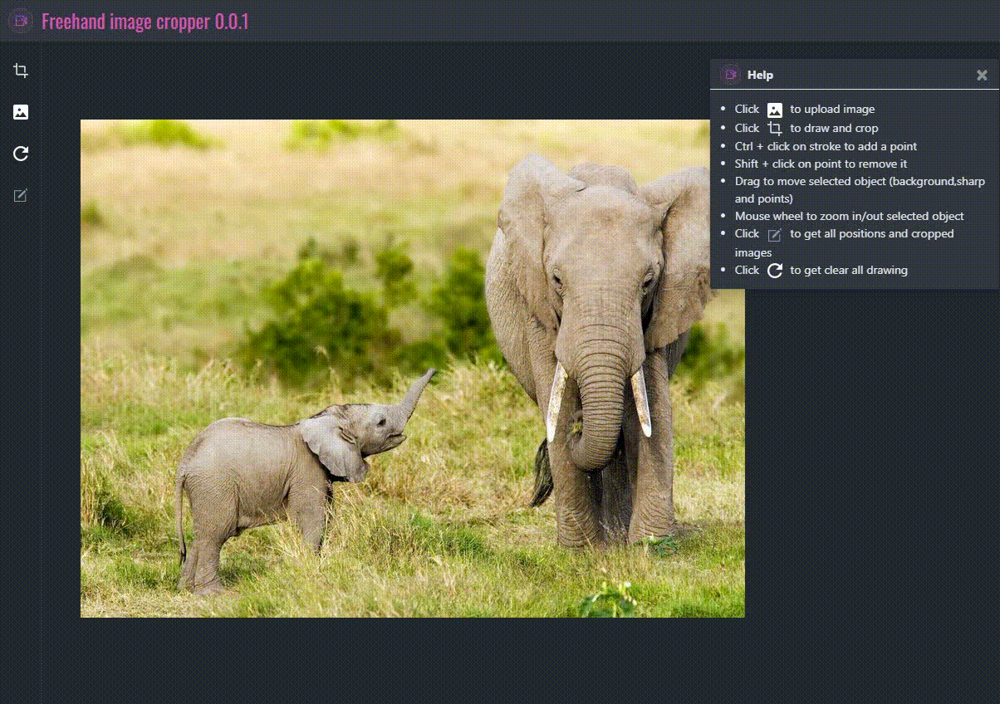

# LF Freehand image cropper
<span class="badge-npmversion"><a href="https://npmjs.org/package/@linkfuture/cropper" title="View this project on NPM"></a></span>
<span class="badge-npmdownloads"><a href="https://npmjs.org/package/@linkfuture/cropper" title="NPM Download"></a></span> 
<span class="badge-npmlicense"><a href="#license" title="License"></a></span>  
Freehand image cropper built with HTML5 canvas  
## Demo
https://cyokin.github.io/lf-freehand-cropper/ 

## Project setup
```
    npm install @linkfuture/cropper
    import cropper from '@linkfuture/cropper';
    let cropper = new Cropper("canvas",option); //canvas id or canvas object
    cropper.setImage("<backgaround image source>");//backgaround image source, url or base64 image string
    cropper.getImage(); //get image source
    cropper.startPen(option); //start crop by using pen 
    cropper.getPos();   //get position list of object,  which related to the image
    cropper.clear();    //clear all drawing, but for the image
    cropper.destroy();    //clear all drawing and image, destory paper objects
    cropper.crop(imgPos);  //get croppered image by passing image position, which given by cropper.getPos()
    cropper.draw(points,option);  //draw sharp by given points, options.onDrawEnd(path) event.
    cropper.options;  //get or set options
    cropper.enableFullMove(); // enable full move model, any drawing object will be moved or zoom with the image. 
    cropper.disableFullMove(); // disable full move model, image and drawing object will be moved or zoom by selected 
    cropper.objects[1].getPos() //get object position, which related to the image
    cropper.objects[1].move //boolean, moveable
    cropper.objects[1].zoom //boolean, zoomable
    cropper.objects[1].locked //boolean, can't select and move
    cropper.objects[1].selectedColor //color when selected
    cropper.objects[1].strokeColor //color for pen 
```
### Options
```
    move:true   //element moveable
    select:true //element selectable
    zoom:true   //element zoomable
    fullZoom:true   //entire object zoomable
    strokeColor:"#39f"  //color for pen
    selectedColor:null  //color for selected object 
    fillColor:new Color(0,0,0,0.1) //color for fill object
    onSelected:(obj)=>{}   //event when selected object
    onDrawEnd:(path)=>{}    //event when draw end
```
### Compiles and minifies for production
```
    npm run release //generate cropper.min.js
    npm run start   //start local demo
```

### Freehand image cropper release package
download [here](lib/lf-cropper.min.js)
